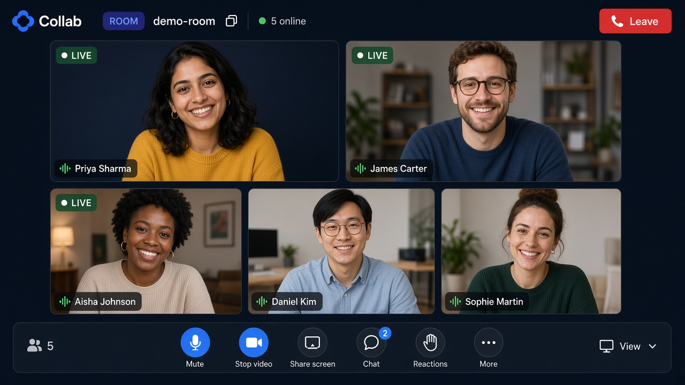
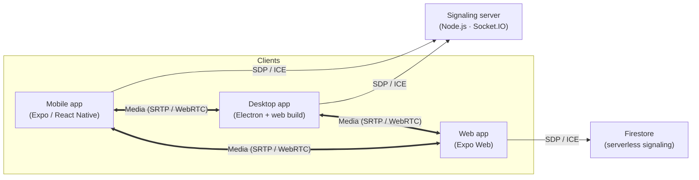
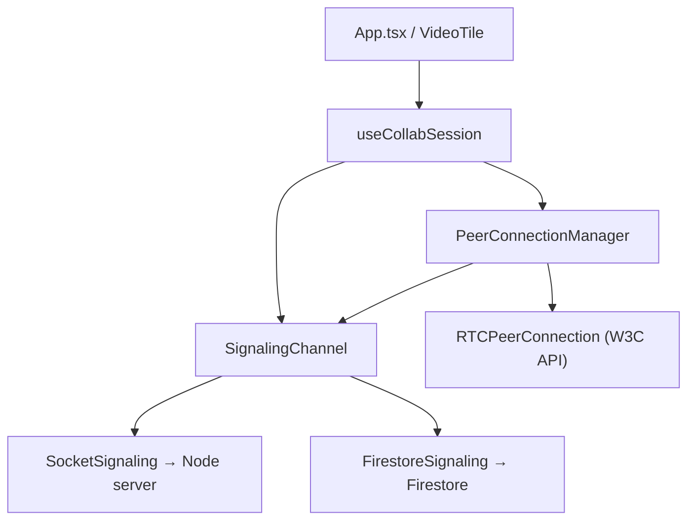
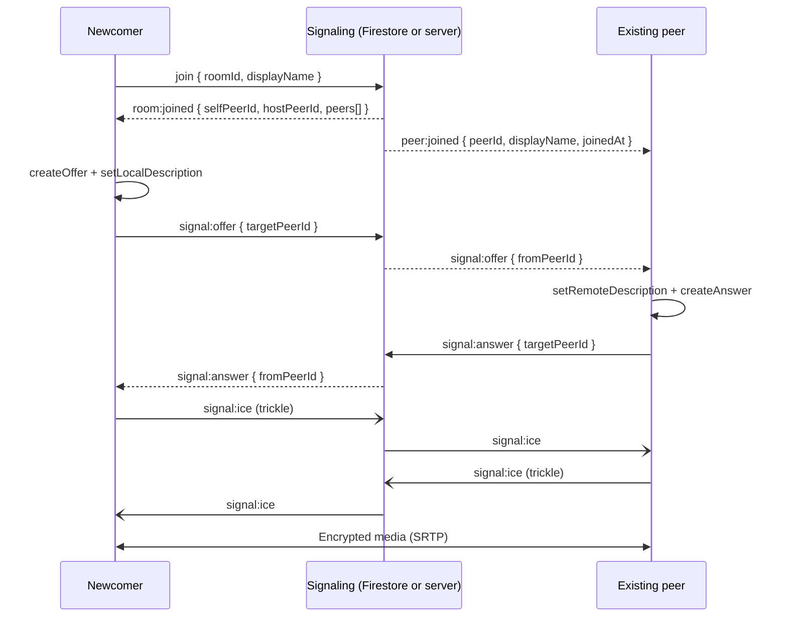

# Collab



> Cross-platform video conferencing built with React Native, Expo, WebRTC, and a Node.js signaling server. One codebase ships to **macOS, Windows, iOS, and Android**.

<p>
  <a href="https://github.com/alexalghisi/collab/actions/workflows/ci.yml"></a>
  <a href="https://github.com/alexalghisi/collab/actions/workflows/release.yml"></a>
  <a href="./LICENSE"></a>
</p>

---

## Table of contents

- [Download & run (for recruiters)](#download--run-for-recruiters)
- [Features](#features)
- [Architecture](#architecture)
- [Call setup flow](#call-setup-flow)
- [Project structure](#project-structure)
- [Local development](#local-development)
- [Building release binaries](#building-release-binaries)
- [iOS distribution (EAS / TestFlight)](#ios-distribution-eas--testflight)
- [Quality gates](#quality-gates)

---

## Download & run (for recruiters)

Prebuilt binaries are published automatically for every tagged release.

1. Open the **[Releases](https://github.com/alexalghisi/collab/releases)** tab of this repository.
2. Expand **Assets** on the latest release and download the file for your platform:

| Platform              | Asset                        | How to run                                                                                 |
| --------------------- | ---------------------------- | ------------------------------------------------------------------------------------------ |
| Android               | `app-release.apk`            | Copy to an Android device and open it. Allow "install from unknown sources" when prompted. |
| iOS                   | `Collab-unsigned.ipa`        | Unsigned build — install by sideloading (AltStore / Sideloadly) or use TestFlight (below). |
| Windows               | `Collab.Setup.<version>.exe` | Run the installer and launch **Collab** from the Start menu.                               |
| macOS (Apple Silicon) | `Collab-<version>-arm64.dmg` | Open the `.dmg`, drag **Collab** into Applications, then launch it.                        |
| macOS (Intel)         | `Collab-<version>-x64.dmg`   | Open the `.dmg`, drag **Collab** into Applications, then launch it.                        |
| Linux (AppImage)      | `Collab-<version>.AppImage`  | `chmod +x` the file, then run it. Works on most distributions.                             |
| Linux (Debian/Ubuntu) | `Collab-<version>.deb`       | Install with `sudo dpkg -i Collab-<version>.deb`, then launch **Collab**.                  |

> The macOS and Windows builds are unsigned in this scaffold. On macOS, right-click the app and choose **Open** the first time to bypass Gatekeeper. On Windows, choose **More info -> Run anyway** on the SmartScreen prompt.

iOS ships as an **unsigned** `.ipa`. Apple does not allow installing a downloaded `.ipa` directly, so it must be sideloaded (AltStore / Sideloadly) or, for the signed route, installed via TestFlight — see [iOS distribution](#ios-distribution-eas--testflight).

---

## Features

- Multi-party video and voice calls over a mesh of WebRTC peer connections; join with video or audio only and turn the camera on later without renegotiation.
- In-call controls: mute, camera on/off, screen sharing (web), raise hand, emoji reactions, participants list with live status, and meeting chat. The microphone is opened with echo cancellation, noise suppression and automatic gain control, so room hum and speaker feedback do not ride along.
- Shareable invite links (`?room=…`) with human-friendly meeting IDs. From a live meeting you can **send an email or SMS** with the join link; the signaling server delivers it through Twilio (SMS) or Resend (email).
- Collaboration inside the call: a shared **whiteboard** (freehand strokes synced live, undo your own, clear for everyone, late joiners get the current drawing) and **live captions** — each participant's speech becomes a turn on a shared transcript (Web Speech API on web; phones see the room's log but cannot contribute until a hosted recognizer is wired in).
- **Follow the host**: when the host opens the whiteboard or the editor, everyone's screen moves with them, and a late joiner lands on the same surface. Anyone else can open a surface for themselves without dragging the room along.
- **Embedded editor**: a shared code document (Monaco on web and desktop, live read-only on phones) with every participant's cursor and selection in their own colour, and a **Run** button that executes the room's code — JavaScript, TypeScript, Python or Go — in a network-less, resource-capped, throwaway sandbox and streams the output to everyone.
- **Meeting assistant**: an in-call panel that answers questions from the live transcript and chat, and a **Search** view on the dashboard that retrieves passages from past meetings. OpenAI, Claude and Gemini are interchangeable via `ASSISTANT_PROVIDER`; with no key the panel reports that the assistant is not enabled.
- **Host tools**: a **waiting room** (admit or deny each newcomer), mute one participant or everyone, remove a participant, and **breakout rooms** — the host spreads participants over N side rooms and brings everyone back with one click.
- **Team chat channels** outside of meetings (Firestore-backed; shared by everyone signed in to the same deployment).
- Home dashboard with one-click **New meeting**, **Join** and **Schedule**; scheduled meetings show up in a monthly **calendar** and an upcoming/past list, and can be added to **Google Calendar** or downloaded as **.ics**. Meetings are stored per user in Firestore (or locally in the browser when Firebase is not configured).
- Optional Google / Facebook sign-in on every platform (Firebase on web, Expo AuthSession on mobile), with a guest-lobby fallback when unconfigured.
- Pluggable signaling behind one typed contract: **Firestore** on web (serverless, no backend to host) or the bundled **Socket.IO** server.
- Single TypeScript codebase for mobile (iOS/Android), web, and desktop (macOS/Windows via Electron).
- Automated multi-platform release pipeline that publishes installable binaries to GitHub Releases.
- Strict CI quality gates: Prettier, ESLint, and TypeScript.

---

## Architecture

Collab uses a **mesh topology**: each participant holds a direct `RTCPeerConnection` with every other participant. Signaling never touches media — it only relays SDP and ICE metadata to bootstrap the peer connections.

Signaling is a small interface (`SignalingChannel`) with two transports:

- **Firestore** (web, when Firebase is configured) — rooms, participants, per-peer signal inboxes, chat, whiteboard strokes, captions, room settings and the waiting list live in Firestore, so the deployed web app needs no server at all. Host commands (mute / remove / move) travel through the same per-peer inboxes as SDP and ICE.
- **Socket.IO** (mobile, desktop, and web without Firebase) — the bundled Node.js server in `server/`, which also keeps each room's whiteboard, captions, settings and waiting list in memory while the room is occupied, and only honours host commands coming from the current host.

### Live captions

Spoken turns travel over the same `SignalingChannel` as chat (`transcript:segment`).
The browser's speech recognizer (Web Speech API) is the first caption source;
`createSpeechCapture` is the swap point for a hosted recognizer later. The
server stamps the speaker from the socket, so a client cannot put someone
else's name on a turn. A participant the host removed cannot keep sending
them. Late joiners get the log the same way they get whiteboard strokes:

- **Socket.IO** — the room holds the turns in memory and includes them in
  `room:joined`, then drops them when the room empties.
- **Firestore** — turns are appended to `rooms/{id}/transcript` and streamed
  to a joiner in start order.

Phones have no Web Speech API, so they show the room's transcript but do not
start a recognizer. That tradeoff is deliberate: a silent gap is worse than
a documented one.

### Meeting search index

Transcripts and chat are chunked and embedded behind one
`VectorStore` interface with three backends, chosen by `VECTOR_STORE` the
same way signaling is chosen:

| Value              | Store                                                                                             |
| ------------------ | ------------------------------------------------------------------------------------------------- |
| _unset_ / `memory` | In-process. Default for local development and CI.                                                 |
| `postgres`         | Self-hosted Postgres with [pgvector](https://github.com/pgvector/pgvector). Needs `DATABASE_URL`. |
| `pinecone`         | [Pinecone](https://www.pinecone.io). Needs `PINECONE_API_KEY` and `PINECONE_INDEX`.               |

The embedder is a local hashing vector when no key is set, and OpenAI
`text-embedding-3-small` when `OPENAI_API_KEY` is present. Callers only see
`Embedder`; swapping the model does not touch the store.

### Meeting assistant

The in-call assistant and the dashboard search share that index. A question
is `assistant:ask` on the signaling channel (or `POST /assistant` on the
Firestore path, the same split as code execution). The reply is streamed to
the whole room as `assistant:token` / `assistant:done`, or `assistant:error`
when the model is missing or refuses. Structured actions (action items,
decisions) come back as schema-checked JSON; conversational answers stay
plain text.

`ASSISTANT_PROVIDER` selects OpenAI, Claude or Gemini. The calling code
imports none of those packages — only `AssistantModel`. A removed
participant cannot keep asking. The eval harness in `src/assistant/evals/`
runs in CI against a fixed transcript fixture and the properties a good
summary of that fixture must have.

### Shared code document

The collaborative editor is a [Yjs](https://yjs.dev) document that travels over
the same `SignalingChannel` as everything else — there is no `y-websocket`
server to deploy. Two message types carry it: `code:update` for document
updates and `code:awareness` for cursors and selections, both base64-encoded
because both transports are JSON.

Late joiners are served the same way whiteboard strokes are, per transport:

- **Socket.IO** — the server merges updates into one `Y.Doc` per room and hands
  the merged state to a joiner in `room:joined`, then drops it when the room
  empties. Awareness is relayed and never stored.
- **Firestore** — updates are appended to `rooms/{id}/codeUpdates` and replayed
  to a joiner in order; the host squashes the log into a single update once it
  grows past a threshold, which bounds both storage and replay cost. Awareness
  rides on the author's participant document, throttled, since cursor moves are
  continuous.

### Running code

Running a submission is off unless a sandbox is configured, because it executes
whatever a participant typed. Set `EXECUTION_BACKEND` on the server:

| Value    | Sandbox                                                                                                                                                                               |
| -------- | ------------------------------------------------------------------------------------------------------------------------------------------------------------------------------------- |
| _unset_  | Disabled. The Run button reports that execution is not enabled on this deployment.                                                                                                    |
| `docker` | One throwaway container per run, for a host that can reach a Docker daemon.                                                                                                           |
| `piston` | A [Piston](https://github.com/engineer-man/piston) deployment, for hosts that cannot. Set `EXECUTION_PISTON_URL` to your own instance to keep submissions inside your infrastructure. |

The Docker sandbox runs each submission with no network (`--network none`), a
read-only root filesystem, capped memory, swap, CPU and process count, all
capabilities dropped, no privilege escalation, as an unprivileged user, and a
wall clock it cannot outlive — the container is killed by name on timeout. The
code is copied into a throwaway volume and named as the program to run rather
than interpolated into a command, so there is no shell to escape. Output is truncated
past 128 KB so a runaway loop cannot fill the room's screens. Runs are rate
limited per room and per participant on the server, and a participant the host
removed cannot run anything at all.

JavaScript, TypeScript and Python run on the stock `node:22-alpine` and
`python:3.12-alpine` images. Go needs one image built up front, because a cold
`go run` compiles the standard library and spends about 50 seconds doing it:

```bash
docker build -f server/sandbox/go.Dockerfile -t collab-sandbox-go server/sandbox
```

That image ships a populated build cache, which each run gets as its own
throwaway copy — around three seconds for a Go submission instead of a minute.

Both transports use the same service: the Socket.IO path relays `code:run` and
streams `code:output` to everyone in the room, and the Firestore path posts to
`POST /execute` on the same server and publishes the run as a document the room
watches. `EXPO_PUBLIC_EXECUTION_URL` overrides where the client posts, which is
what a Firestore deployment needs since it has no signaling URL of its own.
`GET /execute` reports whether execution is enabled and which sandbox is in use.



The reusable core is deliberately platform-agnostic. It is written against the standard W3C WebRTC API; on native platforms `react-native-webrtc` registers the same globals via `registerGlobals()`, so the exact same negotiation logic runs everywhere.



---

## Call setup flow

For every pair of peers exactly one side sends the offer: the one that joined
later (ties broken by peer id). This keeps negotiation glare-free on both
transports without any extra round trip.



---

## Project structure

```
Collab/
├── App.tsx                     # Root component: auth gate, app shell, meeting screen
├── index.ts                    # Expo entry point; registers WebRTC globals
├── app.json                    # Expo configuration
├── app.config.js               # Applies the GitHub Pages sub-path only when WEB_BASE_URL is set
├── src/
│   ├── components/
│   │   ├── shell/              # Sidebar / tab-bar navigation
│   │   ├── home/               # Dashboard (new / join / schedule, up next)
│   │   ├── meetings/           # Upcoming & past lists, schedule form
│   │   ├── calendar/           # Monthly calendar
│   │   ├── meeting/            # In-call screen: toolbar, participants + host tools, chat, whiteboard, waiting room
│   │   ├── chat/               # Team channels screen and the shared message thread
│   │   └── ui/                 # Shared buttons and icon types
│   ├── chat/                   # Team chat channels (Firestore) and its hook
│   ├── firebase/               # Single Firebase app / Auth / Firestore instance (web)
│   ├── hooks/                  # useCollabSession orchestration hook
│   ├── meeting/                # Meeting model, store (Firestore / local), calendar + .ics helpers, invite links / email / SMS
│   ├── signaling/              # Event contract, SignalingChannel, Socket.IO + Firestore transports
│   ├── transcript/             # Live captions: segment contract and the speech-recognizer adapter
│   ├── search/                 # VectorStore (memory / pgvector / Pinecone) and meeting chunking
│   ├── assistant/              # Meeting assistant tools, providers, and the CI eval harness
│   └── webrtc/                 # RTC configuration, PeerConnectionManager, media helpers
├── server/
│   └── src/                    # Express + Socket.IO signaling server
├── firestore.rules             # Security rules for signaling rooms, channels and per-user meetings
├── desktop/                    # Electron shell + electron-builder config (.dmg / .exe)
├── scripts/                    # Build helpers
└── .github/                    # CI, release workflow, issue & PR templates
```

---

## Local development

### Prerequisites

- Node.js 20+
- For native builds: Android Studio (Android) and Xcode (iOS)

### 1. Install dependencies

```bash
npm install
```

### 2. Start the signaling server

```bash
npm run server
```

The server listens on `http://localhost:4000` and exposes `GET /health`. After
`npm run export:web` it also serves that build, so opening `http://localhost:4000`
loads the app and the socket from the same origin — one port, one tunnel.

Skip this step on web if Firebase is configured (see below): the web app then
signals through Firestore. Publish [`firestore.rules`](firestore.rules) in the
Firebase console once (Firestore Database → Rules).

### 3. Start the app

```bash
npm start        # Expo dev server (choose a target)
npm run web      # Web
npm run android  # Android device / emulator
npm run ios      # iOS simulator
```

With no `EXPO_PUBLIC_SIGNALING_URL`, the client dials the page's own host on
port 4000 (and `http://localhost:4000` from a loopback preview). A phone on
the LAN therefore reaches the desktop running the server instead of its own
loopback. Override the URL when the server lives somewhere else.

### Social sign-in (Google / Facebook)

Sign-in is optional: with no credentials configured the app runs as an open
guest lobby. Copy [`.env.example`](.env.example) to `.env` and fill in the
values below to enable "Continue with Google" and "Continue with Facebook".

- **Web** uses Firebase, so it reads the Firebase web config:
  - `EXPO_PUBLIC_FIREBASE_API_KEY`
  - `EXPO_PUBLIC_FIREBASE_AUTH_DOMAIN`
  - `EXPO_PUBLIC_FIREBASE_PROJECT_ID`
  - `EXPO_PUBLIC_FIREBASE_APP_ID`
- **Mobile (iOS / Android)** signs in through Expo AuthSession, so it reads the
  OAuth client IDs directly:
  - `EXPO_PUBLIC_GOOGLE_WEB_CLIENT_ID`, `EXPO_PUBLIC_GOOGLE_IOS_CLIENT_ID`,
    `EXPO_PUBLIC_GOOGLE_ANDROID_CLIENT_ID`
  - `EXPO_PUBLIC_FACEBOOK_APP_ID`

Redirects use the app's `collab` scheme, which is already declared in `app.json`.

### 4. Run the desktop shell locally

```bash
npm run export:web      # produce the static web build in dist-web/
npm run desktop:web     # stage it into desktop/web/
cd desktop && npm install && npm start
```

---

## Deploying the web app

`.github/workflows/pages.yml` exports the web build and publishes it to GitHub
Pages. The export is static, so it carries no signaling backend of its own — the
deployed app has to be told at build time how rooms are coordinated. Pick one:

**Firestore (no server).** Add the Firebase web config as repository secrets
(_Settings → Secrets and variables → Actions → Secrets_) and publish
[`firestore.rules`](firestore.rules) in the Firebase console:

`EXPO_PUBLIC_FIREBASE_API_KEY`, `EXPO_PUBLIC_FIREBASE_AUTH_DOMAIN`,
`EXPO_PUBLIC_FIREBASE_PROJECT_ID`, `EXPO_PUBLIC_FIREBASE_APP_ID`

**Socket.IO server.** Deploy [`server/`](server) anywhere that can run a Node
process and hold a WebSocket open. [`render.yaml`](render.yaml) is a Render
blueprint for exactly that (_New → Blueprint_, point it at this repository); it
builds [`server/Dockerfile`](server/Dockerfile) and health-checks `/health`.
Then add the public URL as the repository **variable**
`EXPO_PUBLIC_SIGNALING_URL` (for example `https://collab-signaling.onrender.com`)
and re-run the workflow. Restrict the server to your own origin with the
`CORS_ORIGIN` environment variable; it defaults to `*`.

In-call **SMS and email invites** go through that same server. Set Twilio
(`TWILIO_ACCOUNT_SID`, plus either `TWILIO_AUTH_TOKEN` or an API key
`TWILIO_API_KEY_SID` / `TWILIO_API_KEY_SECRET`, and `TWILIO_FROM_NUMBER`) to
deliver texts, and Resend (`RESEND_API_KEY`, `RESEND_FROM`) for mail. `PUBLIC_APP_URL`
is the join link written into the message — use the public site, not
`localhost`, or the recipient cannot open it. A Twilio trial only delivers to
numbers you have verified in their console.

With neither configured, the build falls back to `http://localhost:4000` and
joining a meeting fails with `Unable to reach the signaling service at
http://localhost:4000.` — the error names the URL it tried so a missing
deployment variable is obvious.

> Render's free instances sleep when idle, so the first join after a quiet
> period waits for a cold start.

---

## Building release binaries

Releases are fully automated. Pushing a version tag triggers `.github/workflows/release.yml`, which builds every platform in parallel and uploads the assets to a GitHub Release.

```bash
git tag v1.0.0
git push origin v1.0.0
```

| Job     | Runner           | Output                                       |
| ------- | ---------------- | -------------------------------------------- |
| Android | `ubuntu-latest`  | `.apk` via `expo prebuild` + Gradle          |
| Windows | `windows-latest` | `.exe` installer via Electron Builder (NSIS) |
| macOS   | `macos-latest`   | `.dmg` (arm64 + x64) via Electron Builder    |
| Linux   | `ubuntu-latest`  | `.AppImage` and `.deb` via Electron Builder  |

> The Android job signs the release APK with the debug keystore for a zero-config demo. For production, add a release keystore and configure `android/app/build.gradle` signing plus repository secrets.

---

## iOS distribution (EAS / TestFlight)

The Releases tab includes an **unsigned** `Collab-unsigned.ipa` built by CI. Because Apple requires every iOS app to be signed, that file cannot be installed by simply downloading it — install it by sideloading with [AltStore](https://altstore.io) or [Sideloadly](https://sideloadly.io), which re-sign it with your own Apple ID on device.

For a signed, shareable build (recommended for reviewers), distribute through Expo Application Services (EAS) and TestFlight. This requires a paid **Apple Developer Program** membership.

### One-time setup (local)

```bash
npm install -g eas-cli
eas login
eas init                 # links the repo to an EAS project (writes extra.eas.projectId)

# Configure Apple signing credentials on EAS (distribution cert + provisioning profile)
eas credentials

# Store the App Store Connect API key EAS uses to submit non-interactively
eas submit --platform ios --profile production   # run once, choose "API Key" and save it
```

### Build and submit

Locally:

```bash
eas build --platform ios --profile production --auto-submit
```

Or from CI: run the **iOS TestFlight** workflow (`.github/workflows/ios-testflight.yml`) via _Actions → iOS TestFlight → Run workflow_. It builds the signed binary on EAS and submits it to TestFlight automatically. Add one repository secret first:

| Secret       | Where to get it                                        |
| ------------ | ------------------------------------------------------ |
| `EXPO_TOKEN` | [expo.dev](https://expo.dev) → Account → Access tokens |

The workflow is manual-only (`workflow_dispatch`), so it never runs — and never fails CI — until you trigger it. Once the build finishes processing in App Store Connect, invite reviewers as TestFlight testers. See the [EAS Build docs](https://docs.expo.dev/build/introduction/) for details.

---

## Quality gates

Every push and pull request runs `.github/workflows/ci.yml`:

```bash
npm run format      # Prettier (check)
npm run lint        # ESLint
npm run type-check  # TypeScript (strict, no emit)
npm test            # Vitest
```

Tests run on Node against the real modules — the signaling suite starts the
Socket.IO server on an ephemeral port and drives it through the client
transport, so transport behaviour (host hand-over, waiting room, late-join
state) is covered end to end rather than mocked. `npm run test:watch` reruns on
change.

Run `npm run format:fix` and `npm run lint:fix` locally to apply automatic fixes.

---

## License

[MIT](./LICENSE) © Alex Alghisi
