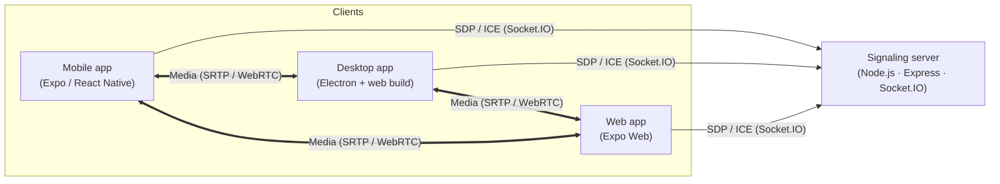
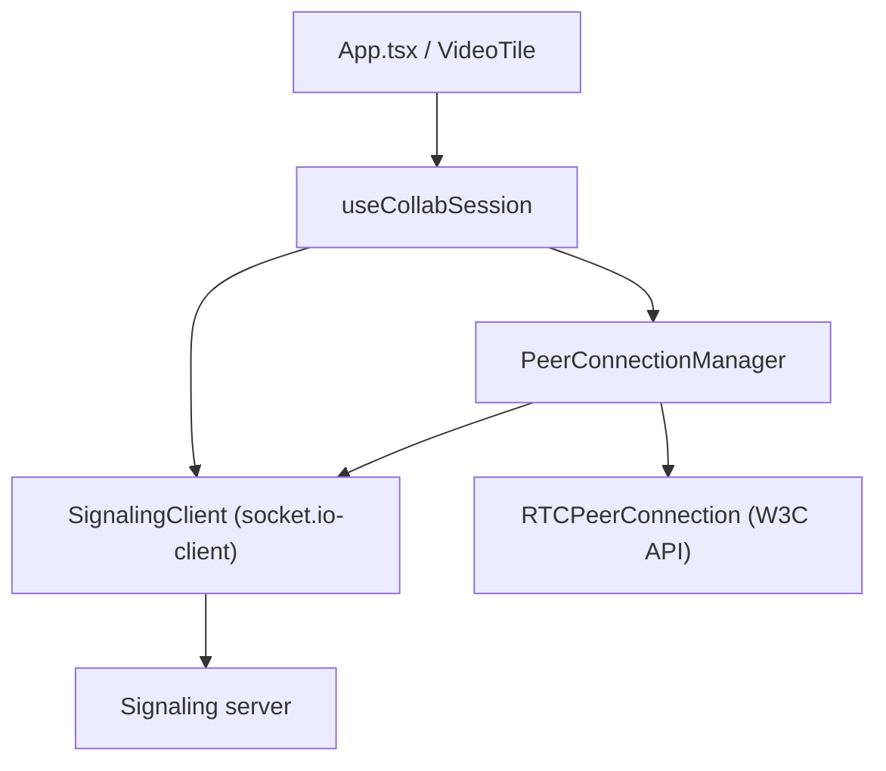
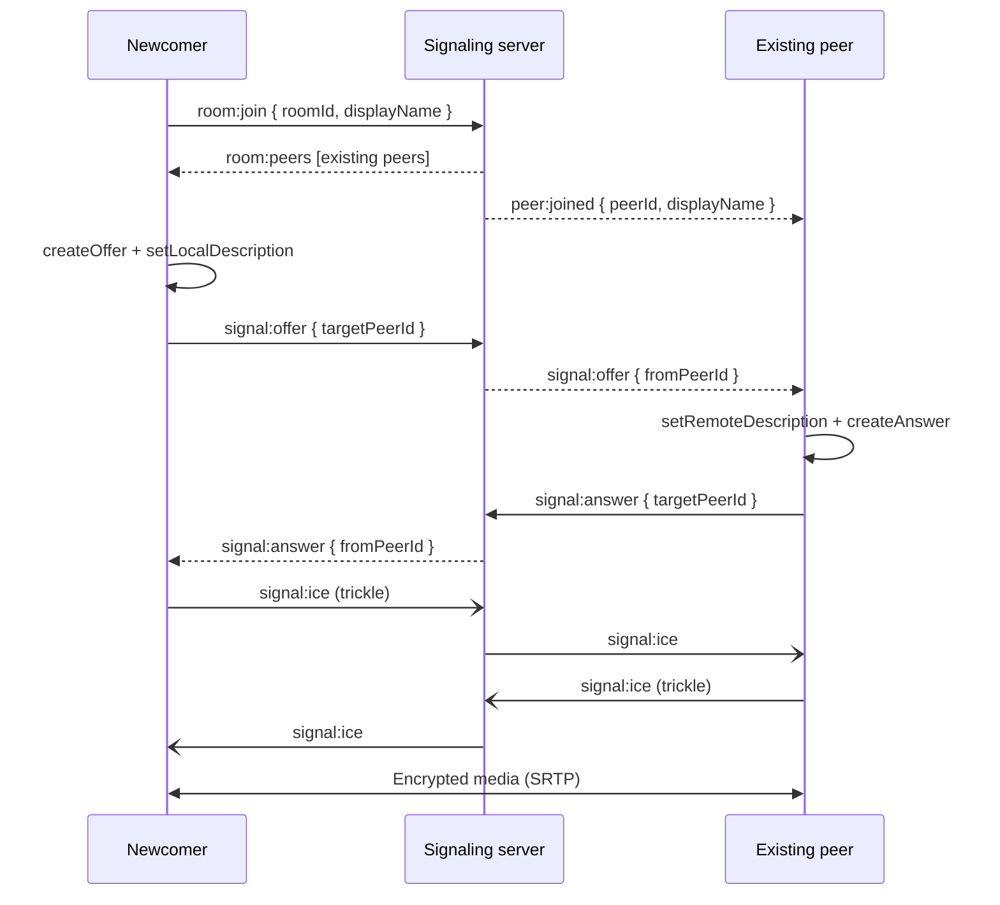

# Collab


> Cross-platform video conferencing built with React Native, Expo, WebRTC, and a Node.js signaling server. One codebase ships to **macOS, Windows, iOS, and Android**.

<p>
  <a href="https://github.com/alexalghisi/collab/actions/workflows/ci.yml"></a>
  <a href="https://github.com/alexalghisi/collab/actions/workflows/release.yml"></a>
  <a href="./LICENSE"></a>
</p>

---

## Table of contents

- [Download & run (for recruiters)](#download--run-for-recruiters)
- [Features](#features)
- [Architecture](#architecture)
- [Call setup flow](#call-setup-flow)
- [Project structure](#project-structure)
- [Local development](#local-development)
- [Building release binaries](#building-release-binaries)
- [iOS distribution (EAS / TestFlight)](#ios-distribution-eas--testflight)
- [Quality gates](#quality-gates)

---

## Download & run (for recruiters)

Prebuilt binaries are published automatically for every tagged release.

1. Open the **[Releases](https://github.com/alexalghisi/collab/releases)** tab of this repository.
2. Expand **Assets** on the latest release and download the file for your platform:

| Platform              | Asset                        | How to run                                                                                 |
| --------------------- | ---------------------------- | ------------------------------------------------------------------------------------------ |
| Android               | `app-release.apk`            | Copy to an Android device and open it. Allow "install from unknown sources" when prompted. |
| iOS                   | `Collab-unsigned.ipa`        | Unsigned build — install by sideloading (AltStore / Sideloadly) or use TestFlight (below). |
| Windows               | `Collab.Setup.<version>.exe` | Run the installer and launch **Collab** from the Start menu.                               |
| macOS (Apple Silicon) | `Collab-<version>-arm64.dmg` | Open the `.dmg`, drag **Collab** into Applications, then launch it.                        |
| macOS (Intel)         | `Collab-<version>-x64.dmg`   | Open the `.dmg`, drag **Collab** into Applications, then launch it.                        |
| Linux (AppImage)      | `Collab-<version>.AppImage`  | `chmod +x` the file, then run it. Works on most distributions.                             |
| Linux (Debian/Ubuntu) | `Collab-<version>.deb`       | Install with `sudo dpkg -i Collab-<version>.deb`, then launch **Collab**.                  |

> The macOS and Windows builds are unsigned in this scaffold. On macOS, right-click the app and choose **Open** the first time to bypass Gatekeeper. On Windows, choose **More info -> Run anyway** on the SmartScreen prompt.

iOS ships as an **unsigned** `.ipa`. Apple does not allow installing a downloaded `.ipa` directly, so it must be sideloaded (AltStore / Sideloadly) or, for the signed route, installed via TestFlight — see [iOS distribution](#ios-distribution-eas--testflight).

---

## Features

- Multi-party calls over a mesh of WebRTC peer connections.
- Optional Google / Facebook sign-in on every platform (Firebase on web, Expo AuthSession on mobile), with a guest-lobby fallback when unconfigured.
- Real-time signaling over Socket.IO with strongly typed events shared between client and server.
- Single TypeScript codebase for mobile (iOS/Android), web, and desktop (macOS/Windows via Electron).
- Automated multi-platform release pipeline that publishes installable binaries to GitHub Releases.
- Strict CI quality gates: Prettier, ESLint, and TypeScript.

---

## Architecture

Collab uses a **mesh topology**: each participant holds a direct `RTCPeerConnection` with every other participant. The signaling server never touches media — it only relays SDP and ICE metadata to bootstrap the peer connections.



The reusable core is deliberately platform-agnostic. It is written against the standard W3C WebRTC API; on native platforms `react-native-webrtc` registers the same globals via `registerGlobals()`, so the exact same negotiation logic runs everywhere.



---

## Call setup flow



---

## Project structure

```
Collab/
├── App.tsx                     # Root React Native component (lobby + call screen)
├── index.ts                    # Expo entry point; registers WebRTC globals
├── app.json                    # Expo configuration
├── src/
│   ├── components/             # VideoTile (base + .native variant with RTCView)
│   ├── hooks/                  # useCollabSession orchestration hook
│   ├── signaling/             # Shared event contract + Socket.IO client
│   └── webrtc/                 # RTC configuration, PeerConnectionManager, media helpers
├── server/
│   └── src/                    # Express + Socket.IO signaling server
├── desktop/                    # Electron shell + electron-builder config (.dmg / .exe)
├── scripts/                    # Build helpers
└── .github/                    # CI, release workflow, issue & PR templates
```

---

## Local development

### Prerequisites

- Node.js 20+
- For native builds: Android Studio (Android) and Xcode (iOS)

### 1. Install dependencies

```bash
npm install
```

### 2. Start the signaling server

```bash
npm run server
```

The server listens on `http://localhost:4000` and exposes `GET /health`.

### 3. Start the app

```bash
npm start        # Expo dev server (choose a target)
npm run web      # Web
npm run android  # Android device / emulator
npm run ios      # iOS simulator
```

By default the app connects to `http://localhost:4000`. Override it with the
`EXPO_PUBLIC_SIGNALING_URL` environment variable.

### Social sign-in (Google / Facebook)

Sign-in is optional: with no credentials configured the app runs as an open
guest lobby. Provide the values below (e.g. in a local `.env`) to enable
"Continue with Google" and "Continue with Facebook".

- **Web** uses Firebase, so it reads the Firebase web config:
  - `EXPO_PUBLIC_FIREBASE_API_KEY`
  - `EXPO_PUBLIC_FIREBASE_AUTH_DOMAIN`
  - `EXPO_PUBLIC_FIREBASE_PROJECT_ID`
  - `EXPO_PUBLIC_FIREBASE_APP_ID`
- **Mobile (iOS / Android)** signs in through Expo AuthSession, so it reads the
  OAuth client IDs directly:
  - `EXPO_PUBLIC_GOOGLE_WEB_CLIENT_ID`, `EXPO_PUBLIC_GOOGLE_IOS_CLIENT_ID`,
    `EXPO_PUBLIC_GOOGLE_ANDROID_CLIENT_ID`
  - `EXPO_PUBLIC_FACEBOOK_APP_ID`

Redirects use the app's `collab` scheme, which is already declared in `app.json`.

### 4. Run the desktop shell locally

```bash
npm run export:web      # produce the static web build in dist-web/
npm run desktop:web     # stage it into desktop/web/
cd desktop && npm install && npm start
```

---

## Building release binaries

Releases are fully automated. Pushing a version tag triggers `.github/workflows/release.yml`, which builds every platform in parallel and uploads the assets to a GitHub Release.

```bash
git tag v1.0.0
git push origin v1.0.0
```

| Job     | Runner           | Output                                       |
| ------- | ---------------- | -------------------------------------------- |
| Android | `ubuntu-latest`  | `.apk` via `expo prebuild` + Gradle          |
| Windows | `windows-latest` | `.exe` installer via Electron Builder (NSIS) |
| macOS   | `macos-latest`   | `.dmg` (arm64 + x64) via Electron Builder    |
| Linux   | `ubuntu-latest`  | `.AppImage` and `.deb` via Electron Builder  |

> The Android job signs the release APK with the debug keystore for a zero-config demo. For production, add a release keystore and configure `android/app/build.gradle` signing plus repository secrets.

---

## iOS distribution (EAS / TestFlight)

The Releases tab includes an **unsigned** `Collab-unsigned.ipa` built by CI. Because Apple requires every iOS app to be signed, that file cannot be installed by simply downloading it — install it by sideloading with [AltStore](https://altstore.io) or [Sideloadly](https://sideloadly.io), which re-sign it with your own Apple ID on device.

For a signed, shareable build (recommended for reviewers), distribute through Expo Application Services (EAS) and TestFlight. This requires a paid **Apple Developer Program** membership.

### One-time setup (local)

```bash
npm install -g eas-cli
eas login
eas init                 # links the repo to an EAS project (writes extra.eas.projectId)

# Configure Apple signing credentials on EAS (distribution cert + provisioning profile)
eas credentials

# Store the App Store Connect API key EAS uses to submit non-interactively
eas submit --platform ios --profile production   # run once, choose "API Key" and save it
```

### Build and submit

Locally:

```bash
eas build --platform ios --profile production --auto-submit
```

Or from CI: run the **iOS TestFlight** workflow (`.github/workflows/ios-testflight.yml`) via _Actions → iOS TestFlight → Run workflow_. It builds the signed binary on EAS and submits it to TestFlight automatically. Add one repository secret first:

| Secret       | Where to get it                                        |
| ------------ | ------------------------------------------------------ |
| `EXPO_TOKEN` | [expo.dev](https://expo.dev) → Account → Access tokens |

The workflow is manual-only (`workflow_dispatch`), so it never runs — and never fails CI — until you trigger it. Once the build finishes processing in App Store Connect, invite reviewers as TestFlight testers. See the [EAS Build docs](https://docs.expo.dev/build/introduction/) for details.

---

## Quality gates

Every push and pull request runs `.github/workflows/ci.yml`:

```bash
npm run format      # Prettier (check)
npm run lint        # ESLint
npm run type-check  # TypeScript (strict, no emit)
```

Run `npm run format:fix` and `npm run lint:fix` locally to apply automatic fixes.

---

## License

[MIT](./LICENSE) © Alex Alghisi
